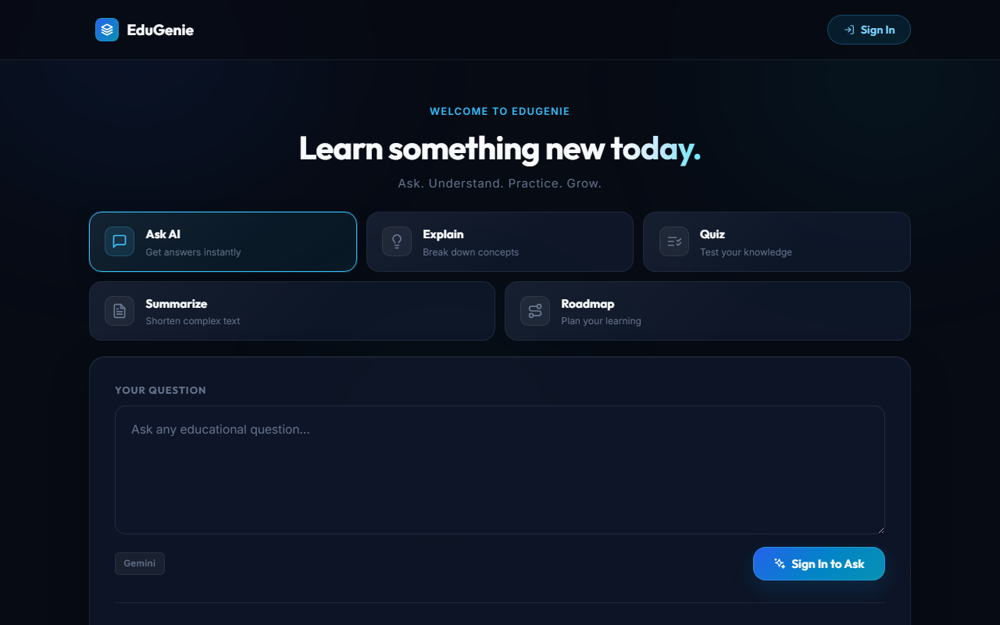
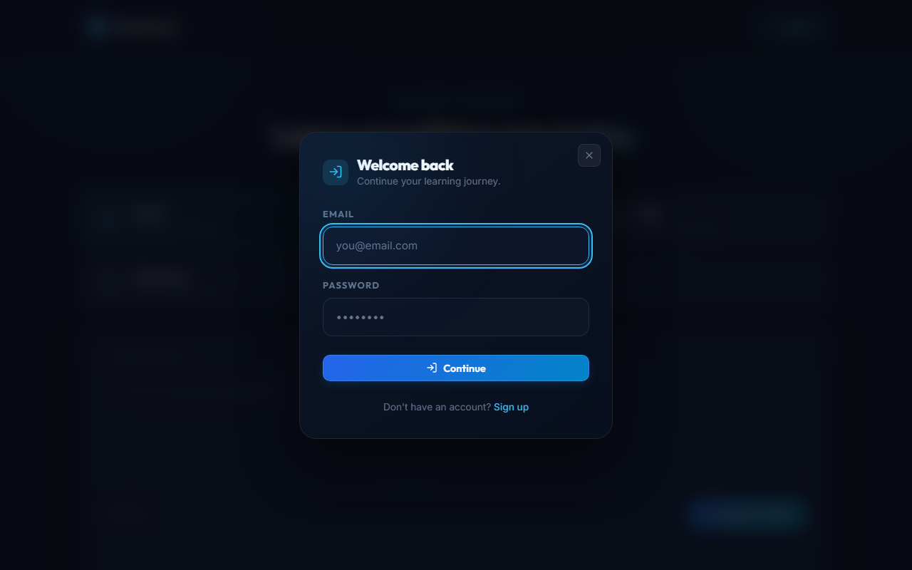
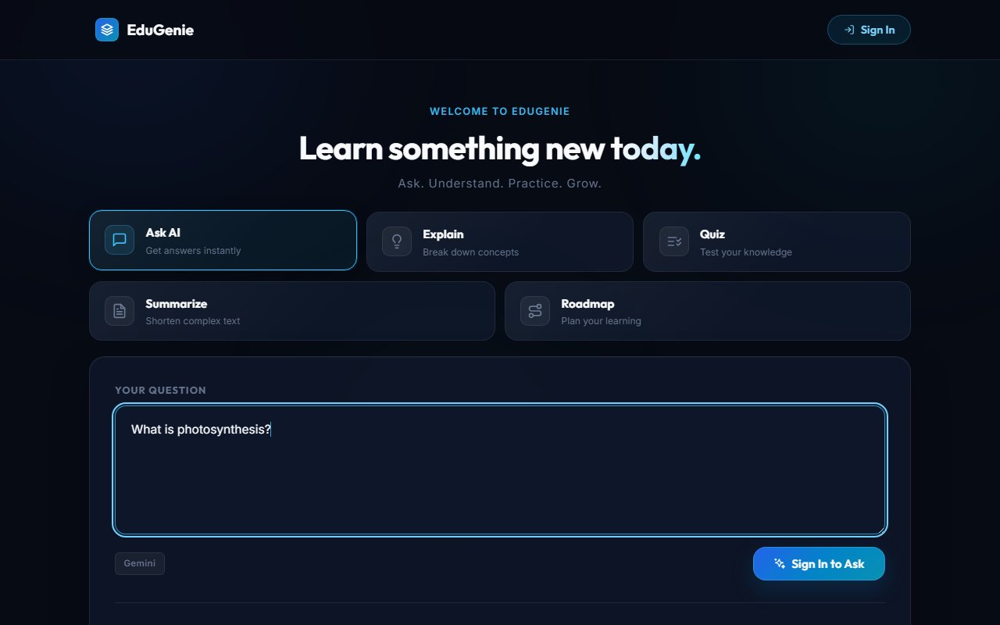
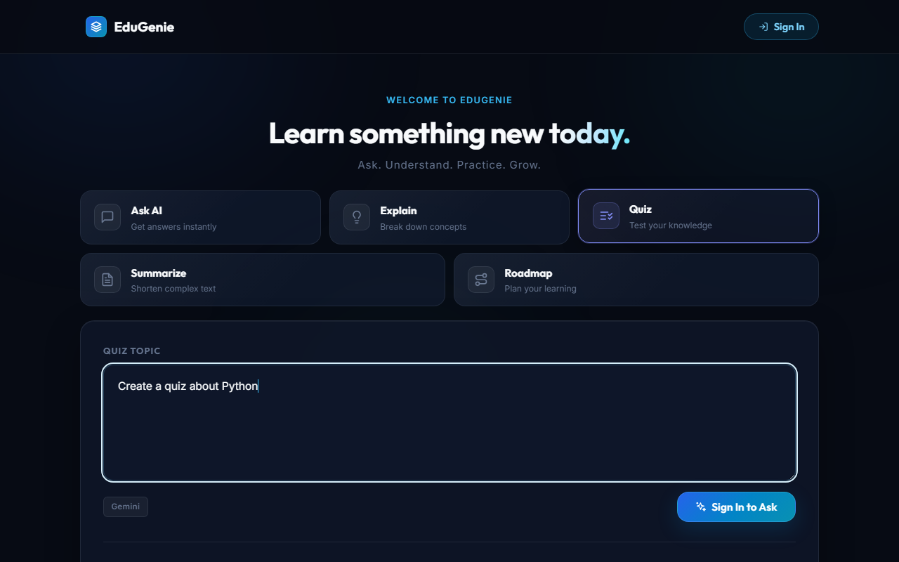
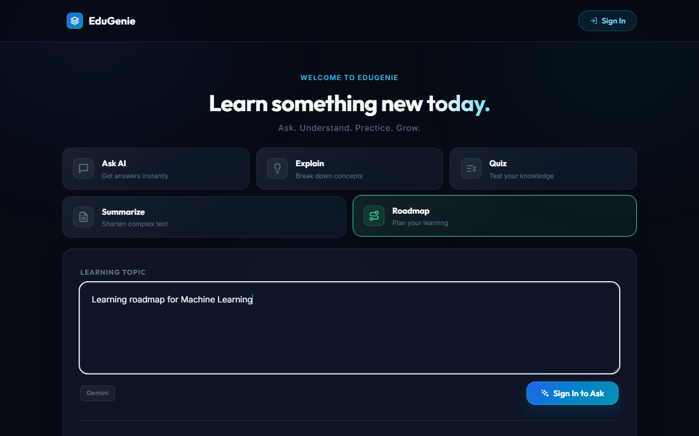
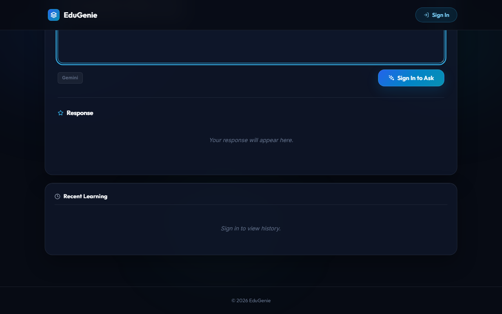

# 🎓 EduGenie – Google Gemini Powered Learning Assistant

<div align="center">


### AI-Powered Educational Learning Assistant using Google Gemini

**Ask • Understand • Practice • Grow**

🌐 **Live Demo:** https://edugenie-learning-assistant.onrender.com

📂 **GitHub Repository:** https://github.com/anok-bodipogu-79/EduGenie-Learning-Assistant

</div>

---

# 📖 Overview

EduGenie is a modern AI-powered educational assistant designed to help students, self-learners, and educators understand concepts faster through Generative AI.

The application integrates **Google Gemini 1.5 Pro** with a lightweight educational platform capable of answering questions, simplifying concepts, generating quizzes, summarizing learning materials, and creating personalized learning roadmaps.

Unlike traditional educational websites, EduGenie provides an interactive AI learning experience where users receive contextual, structured, and personalized educational assistance in real time.

---

# 🚀 Features

- ✅ AI Question Answering
- ✅ Concept Explanation
- ✅ AI Quiz Generation
- ✅ Educational Summarization
- ✅ Personalized Learning Roadmaps
- ✅ User Authentication
- ✅ Learning History
- ✅ Responsive UI
- ✅ PostgreSQL Database Integration
- ✅ FastAPI REST APIs
- ✅ Modern Educational Dashboard

---

# 🖥️ Screenshots

## Landing Page



---

## Login



---

## Dashboard


---

## Ask AI



---

## Quiz Generator



---

## Learning Roadmap



---

## Learning History



---

# ✨ Core Functionalities

## 🔹 AI Question Answering

Students can ask educational questions and receive detailed AI-generated answers using Google Gemini.

---

## 🔹 Concept Explanation

Explains difficult concepts in simple language suitable for beginners.

---

## 🔹 Quiz Generator

Automatically creates multiple-choice quizzes from any topic to test understanding.

---

## 🔹 Text Summarization

Converts lengthy educational content into concise summaries while preserving key information.

---

## 🔹 Personalized Learning Roadmap

Generates structured learning paths from beginner to advanced levels with recommended study resources.

---

# 🏗️ System Architecture

```
                User
                  │
                  ▼
      HTML + CSS + JavaScript
                  │
                  ▼
            FastAPI Backend
                  │
    ┌─────────────┼─────────────┐
    ▼             ▼             ▼
Question     Explanation     Quiz
Answering       Module      Generator

           ▼             ▼
      Summarization   Learning Roadmap

                  │
                  ▼
          Google Gemini API

                  │
                  ▼
            PostgreSQL Database
```

---

# 🛠️ Tech Stack

## Frontend

- HTML5
- CSS3
- JavaScript
- Jinja2 Templates

---

## Backend

- FastAPI
- Python

---

## Database

- PostgreSQL

---

## AI

- Google Gemini 1.5 Pro

---

## Deployment

- Render

---

# 📂 Project Structure

```
EduGenie/
│
├── static/
│   ├── css/
│   ├── js/
│   └── images/
│
├── templates/
│   └── index.html
│
├── models/
│
├── routes/
│
├── database/
│
├── main.py
├── requirements.txt
├── README.md
└── .env
```

---

# ⚙️ Installation

Clone the repository.

```bash
git clone https://github.com/anok-bodipogu-79/EduGenie-Learning-Assistant.git
```

Go into the project.

```bash
cd EduGenie-Learning-Assistant
```

Create a virtual environment.

```bash
python -m venv venv
```

Activate it.

Windows

```bash
venv\Scripts\activate
```

Linux/macOS

```bash
source venv/bin/activate
```

Install dependencies.

```bash
pip install -r requirements.txt
```

Create a `.env` file.

```env
GEMINI_API_KEY=YOUR_API_KEY
DATABASE_URL=YOUR_DATABASE_URL
SECRET_KEY=YOUR_SECRET_KEY
```

Run the project.

```bash
uvicorn main:app --reload
```

Open

```
http://127.0.0.1:8000
```

---

# 📡 API Endpoints

| Endpoint | Description |
|-----------|-------------|
| `/qa` | Question Answering |
| `/explain` | Concept Explanation |
| `/quiz` | Quiz Generation |
| `/summarize` | Educational Summarization |
| `/learn/recommendations` | Personalized Learning Roadmap |

---

# 🗄️ Database

The application uses **PostgreSQL** for storing:

- User Accounts
- Authentication
- User Queries
- AI Responses
- Quiz History
- Learning History
- Personalized Recommendations

---

# 🎯 Problem Statement

Students frequently switch between multiple educational platforms to understand concepts, generate quizzes, summarize notes, and find learning resources.

EduGenie consolidates these learning tasks into a single AI-powered platform that delivers intelligent educational assistance in real time.

---

# 💡 Solution

EduGenie combines Google's Gemini AI with FastAPI and PostgreSQL to provide:

- Instant educational answers
- Simplified explanations
- AI-generated quizzes
- Smart summaries
- Personalized learning paths

through one unified learning platform.

---

# 📈 Key Highlights

- AI-powered educational assistant
- Real-time response generation
- Secure user authentication
- Personalized learning recommendations
- Responsive modern UI
- RESTful FastAPI architecture
- Cloud deployment on Render
- PostgreSQL database integration

---

# 🌍 Live Demo

https://edugenie-learning-assistant.onrender.com

---

# 💻 GitHub Repository

https://github.com/anok-bodipogu-79/EduGenie-Learning-Assistant

---

# 👨💻 Developer

**Bodipogu Anok**

B.Tech – Artificial Intelligence & Data Science

Velagapudi Ramakrishna Siddhartha Engineering College

GitHub

https://github.com/anok-bodipogu-79

---

# 📜 License

This project was developed for educational and learning purposes under the **Google Cloud Generative AI Virtual Internship Program**.

---

<div align="center">

### ⭐ If you found this project useful, consider giving it a star!

</div>
