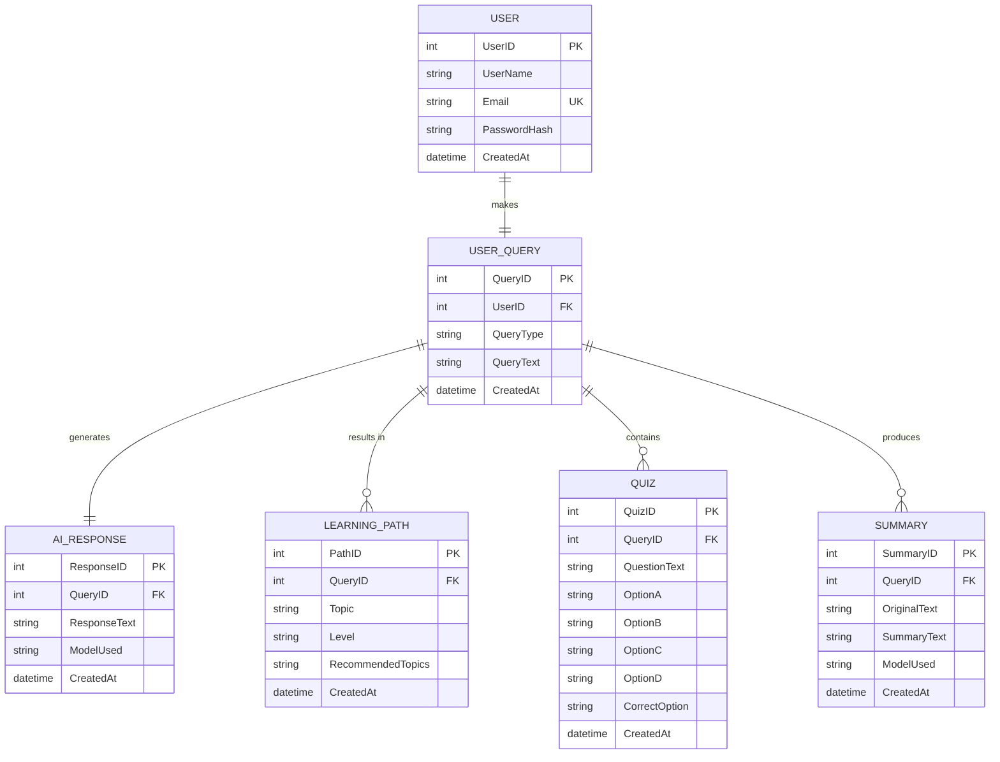

# ER Diagram - EduGenie Learning Assistant

Below is the entity-relationship (ER) diagram representing the SQLite/SQLAlchemy schemas.

## Relationships

1. **USER (1) to USER_QUERY (1)**: Each user session/interaction traces back to a user query record (1-to-1 or 1-to-many relationship).
2. **USER_QUERY (1) to AI_RESPONSE (1)**: Every logged user query has exactly one corresponding AI response output.
3. **USER_QUERY (1) to LEARNING_PATH (1:m)**: A query of type `learn` produces multiple path levels (Beginner, Intermediate, Advanced) stored in the database.
4. **USER_QUERY (1) to QUIZ (1:m)**: A query of type `quiz` leads to exactly 3 distinct MCQ records saved for query analytics.
5. **USER_QUERY (1) to SUMMARY (1:m)**: A query of type `summarize` records the original paragraph and outputs the condensed summary text.
