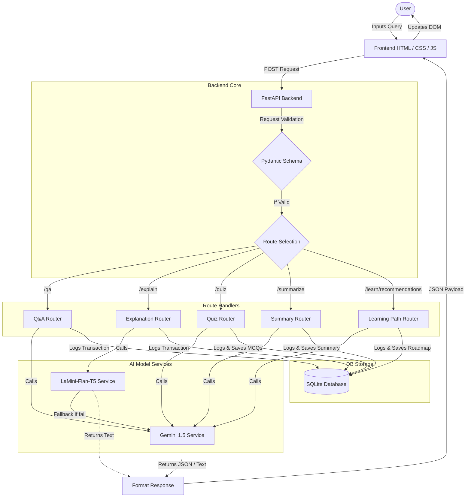

# Project Workflow - EduGenie

Below is the workflow process mapping user requests from the frontend to the backend models and database.

## Detailed Processing Steps

1. **User Request**: The user enters an input query into the single-page application dashboard text area and hits "Submit".
2. **FastAPI Routing**: The requests are routed to specific routes: `/qa`, `/explain`, `/quiz`, `/summarize`, or `/learn/recommendations`.
3. **Execution & Orchestration**:
   - For **Topic Explanation**, the backend attempts to load Hugging Face's local model `LaMini-Flan-T5` on the CPU or GPU. If local packages or resources are missing, it falls back to Gemini 1.5 Flash.
   - For **Q&A, Quiz, Summary, and Learning Path**, the requests invoke the Gemini 1.5 Flash service via the Google Generative AI SDK.
4. **Database Logging**: The transaction input, raw model responses, and customized structures (individual questions or roadmaps) are stored in the SQLite tables using SQLAlchemy ORM.
5. **DOM Render**: The frontend parses the output. For quizzes, it renders click-to-validate buttons; for roadmaps, it displays checkbox checklists; for standard text, it formats clean markdown styling.
